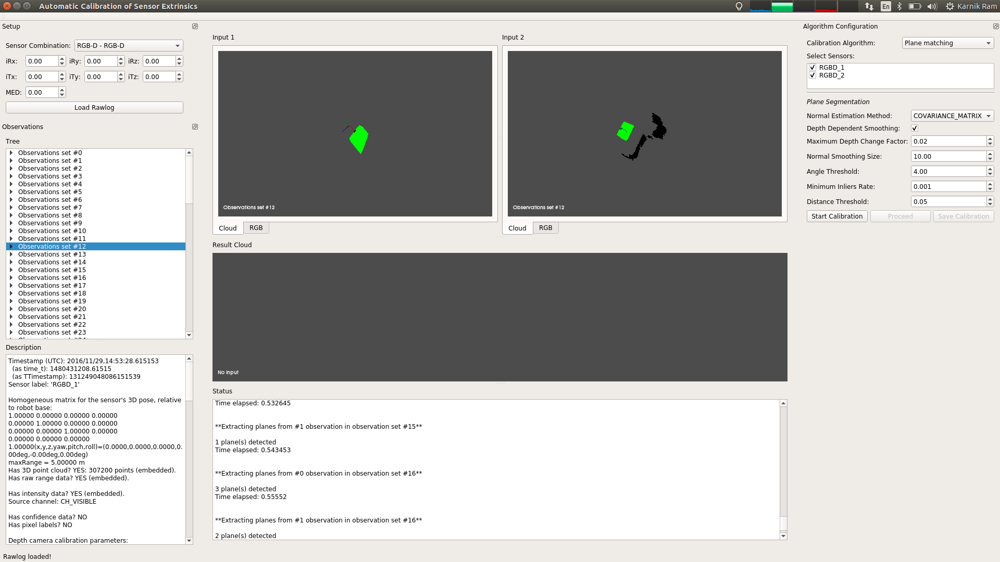

# autocalib-sensor-extrinsics

A GUI app for calibrating the extrinsics between range and visual sensors.

<br>

<br>

NOTE : Work in progress.

## Dependencies

* MRPT (built in Debug mode)
* Qt 5.9
* Point Cloud Library (PCL) 
* OpenCV

## Usage

```bash
git clone https://github.com/karnikram/autocalib-sensor-extrinsics
cd autocalib-sensor-extrinsics
mkdir build && cd build
cmake ..
make
./gui/autocalib-sensor-extrinsics
```

This project is being developed as a part of [Google Summer of Code](https://summerofcode.withgoogle.com/projects/#4592205176504320).

Organization : [Mobile Robot Programming Toolkit](https://github.com/mrpt/mrpt)

Project mentors : [Eduardo Fernandez-Moral](https://github.com/EduFdez), [Jose Luis Blanco Claraco](https://github.com/jlblancoc), [Hunter Laux](https://github.com/jolting)

Project discussion thread : <https://github.com/mrpt/GSoC2018-discussions/issues/2>

<br><br>

<p float="middle">
	
	
</p>
