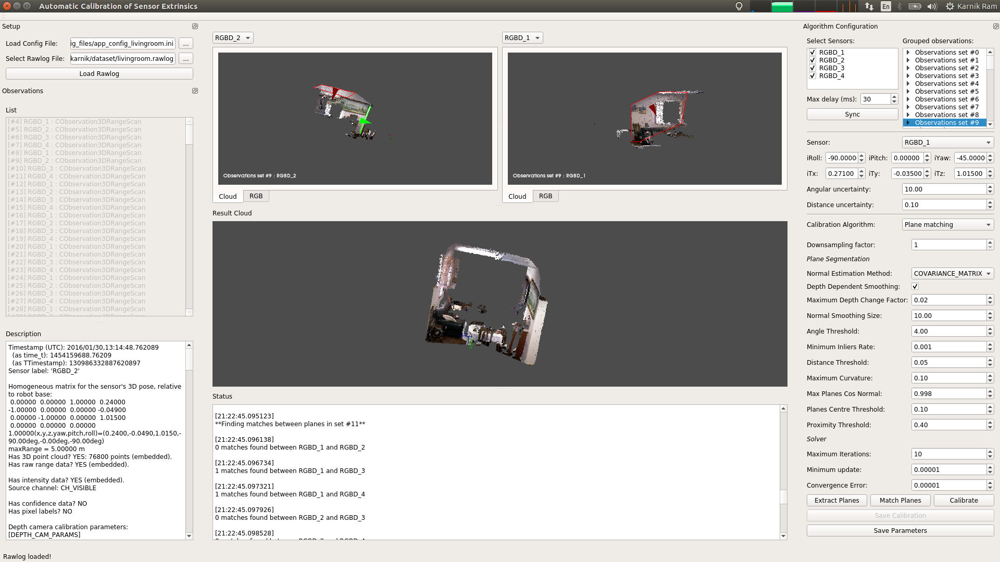
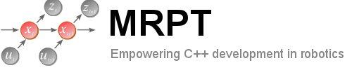

# Automatic Calibration of Sensor Extrinsics 

## Overview
An end-to-end application with a graphical user interface for easily calibrating the extrinsics between range and visual sensors.

Specifically, the app can calibrate the extrinsics of RGB-D cameras, 3D LiDARs, and any combination between them or with RGB cameras. Automatic and target-less calibration algorithms based on plane-matching and line-matching have been integrated into the app, allowing the calibration to be performed in any generic scene setting without the need for any specific targets. The app allows visualizing the data and tuning the parameters through a GUI at each stage of the process, thereby easing calibration efforts.

**Author** : [karnikram](https://github.com/karnikram)<br>

Note : Needs fixing, **NOT RECOMMENDED FOR USE**

<br>
<p align="center">

</p>

### Includes 
* A Qt-based GUI for integrating all the steps of the calibration process - raw data inspection, selecting sensors and grouping observations, feature extraction and matching, results visualization, iterative reruns with different parameters and algorithms - all into one app.

* An implementation of the calibration from planes algorithm[[1]](#references) for calibrating range sensors (RGB-D cameras and 3D LiDARs), and integrated with the GUI. This includes plane extraction and matching, and least-squares minimization of the geometric cost function.

* An implementation of the calibration from lines algorithm[[2]](#references) for calibration range sensors with RGB cameras, and integrated with the GUI. This includes 2D and 3D line extraction and matching, and least-squares minimization of the geometric cost function.

* Well structured code using OOP principles, and with detailed documentation to encourage more contributions. The core algorithms are written independent of the GUI so they can also be potentially run from the command line, independent of the GUI.


## Installation

### Dependencies

* MRPT (built from master in Debug mode)
* Qt v5.9
* Point Cloud Library v1.8 
* OpenCV v3.2

### Build

```bash
git clone https://github.com/karnikram/autocalib-sensor-extrinsics
cd autocalib-sensor-extrinsics
mkdir build && cd build
cmake ..
make
./gui/autocalib-sensor-extrinsics
```

### Unit Tests

TODO

## Usage

[](https://www.youtube.com/watch?v=IWMdQcNshFI)


### Source Reference

The source files have been documented using doxygen style comment blocks. Running the command `doxygen doc/Doxyfile` from the root of the project directory will generate the documentation in HTML that can be browsed.


### License

The source code is released under the [new BSD license.](LICENSE)

autocalib-sensor-extrinsics has been tested with Qt 5.9.5, OpenCV 3.2.0, and PCL 1.8 on Ubuntu 18.04. This contains research code, expect that it changes often and any fitness for a particular purpose is disclaimed.

### References

1) E. Fernandez-Moral, J. Gonzalez-Jimenez, P. Rives and V. Arevalo, "Extrinsic calibration of a set of range cameras in 5 seconds without pattern", IEEE/RSJ International Conference on Intelligent Robots and Systems (IROS), Chicago (USA), 2014. [[link]](https://hal.inria.fr/hal-01010219)
2) A. Perez-Yus, E. Fernandez-Moral, G. Lopez-Nicolas, JJ. Guerrero and P. Rives, "Extrinsic calibration of multiple RGB-D cameras from line observations", IEEE Robotics and Automation Letters 3 (1), 273-280. DOI: 10.1109/LRA.2017.2739104 [[link]](https://hal.inria.fr/hal-01581523)

Please cite the above papers if this application was useful for your research.

---

This project is being developed as a part of [Google Summer of Code](https://summerofcode.withgoogle.com/projects/#4592205176504320).

**Organization** : [Mobile Robot Programming Toolkit](https://github.com/mrpt/mrpt)<br>
**Mentors** : [Eduardo Fernandez-Moral](https://github.com/EduFdez), [Jose Luis Blanco Claraco](https://github.com/jlblancoc), [Hunter Laux](https://github.com/jolting)

**Weekly Progress Logs**: <http://karnikram.info/blog/gsoc-2018-progress/> <br>
**Project discussion thread**: <https://github.com/mrpt/GSoC2018-discussions/issues/2>

**Other minor contributions**: [PR #789](https://github.com/MRPT/mrpt/pull/789), [Issue #2364](https://github.com/PointCloudLibrary/pcl/issues/2364)

## Roadmap
- [x] Design wireframe for gui and setup a base gui skeleton
- [x] Load the observations in the dataset into a treeview
- [x] Setup dock widgets for the app setup, algorithm configuration
- [x] Setup viewer window using qvtk and mrpt cqtglcanvas widgets
- [x] Visualize the cloud and image of each observation in the viewers
- [x] Synchronize the observations in the dataset to form corresponding sets
- [x] Display the synchronized observations in a separate treeview along with reconfiguration options
- [x] Visualize each observation set in the viewer using initial values
- [x] Setup configuration widget for calibration from planes
- [x] Extract planes from each observation in a set
- [x] Visualize extracted planes and their properties in the viewer
- [x] Perform data association between the segmented planes in each set
- [x] Display the associated planes together in the main viewer with initial calibration values
- [x] Setup configuration widget for calibration from lines
- [x] Create and load config file for all the app parameters
- [x] Extract 2D lines from images and visualize
- [x] Extract 3D lines from range images and visualize
- [x] Perform data association between the extracted 3D lines in each set
- [x] Display the associated 3D lines together in the main viewer
- [x] Integrate rotation solvers
- [x] Integrate translation solvers
- [x] Setup widget for editing initial calibration values loaded from config file 
- [x] Add option to switch between sensors in the viewer for multi sensor calibration
- [ ] Unit testing for solvers
- [ ] Integrate ransac
- [ ] Visualize final result

<br><br>

<p align="middle">
	
	
</p>

